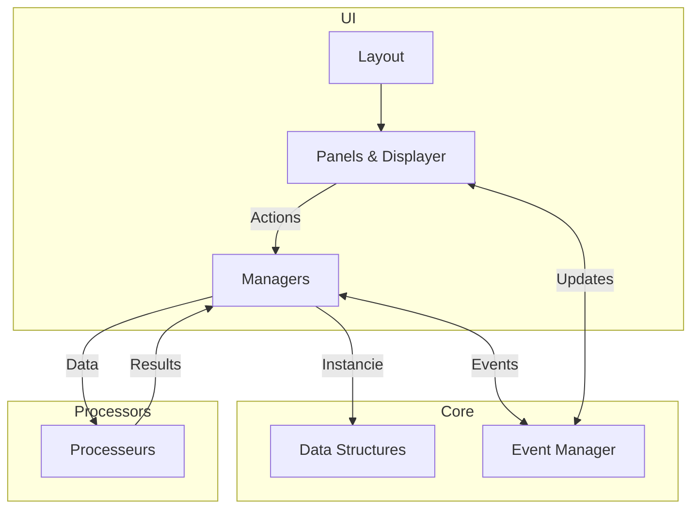

# Architecture SpriteTool

## Règles Fondamentales

### 1. Pipelines
- Toute la logique est décrite dans les pipelines
- Les pipelines définissent les flux d'actions complets
- Chaque fonctionnalité correspond à un ou plusieurs pipelines

### 2. Panels (UI)
- Interface utilisateur et déclenchement d'actions
- Déclenchent les fonctions complètes sur commande utilisateur
- Organisés en panels principaux et sous-panels

### 3. Managers (Core)
- Gèrent leur domaine spécifique
- Maintiennent des fonctions et variables internes
- Point central pour les modifications de données

### 4. States
- Stocke les variables globales
- Centralise les logs
- Point d'accès unique pour la configuration

### 5. Processors
- Fonctions pures uniquement
- Input -> Output sans effets de bord
- Pas de stockage ni d'appels externes

### 6. Event Manager
- Utilisé uniquement pour éviter la récursivité
- Ne centralise pas tous les events
- Appliqué seulement où nécessaire

## Flux de Données (WIP)

