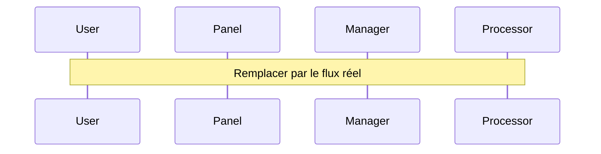

# Template - Nouvelle Fonctionnalité

## 1. Analyse du Pipeline
### Action Utilisateur
- Point de départ dans l'UI
- Paramètres nécessaires
- Retour attendu

### Pipeline Existant ?
- [ ] Vérifier dans [[pipelines/import_export|les pipelines existants]]
- [ ] Si oui : documenter les modifications nécessaires
- [ ] Si non : proposer un nouveau pipeline

## 2. Composants Impliqués

### UI
#### Layout
- Modifications nécessaires à la structure
- Nouveaux composants à ajouter

#### Panel/Displayer
- Point d'entrée utilisateur
- Interactions à gérer
- Validation des inputs

### Core
#### Manager
- Nouvelles données à gérer
- Modifications des structures existantes
- Points d'orchestration

#### Event Manager
- Events nécessaires (si risque de récursivité)
- Points de synchronisation UI

### Processor
- Fonctions de traitement nécessaires
- Données d'entrée/sortie
- Validations à effectuer

## 3. Diagramme du Pipeline

## 4. Points de Contrôle
- [ ] Validation des inputs
- [ ] Gestion des erreurs
- [ ] Tests nécessaires
- [ ] Documentation des classes
- [ ] Mise à jour des pipelines

## 5. Liens Utiles
- [[architecture|Architecture Générale]]
- [[types_de_classes|Types de Classes]]
- Liens vers les classes concernées 